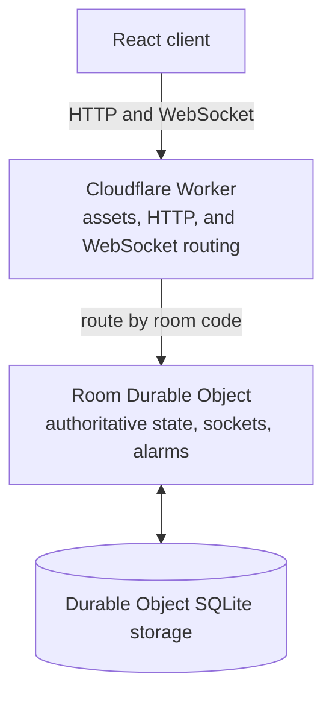

<div align="center">

# GuessTogether

### A real-time multiplayer guessing game where the server decides who wins.

Create a room. Share the code. Make one estimate before the clock runs out.

<p>
  
  
  
  
  
</p>

</div>

## The pitch

GuessTogether is a five-round social game for up to 8 players. Everyone sees the same question, submits one numerical guess, and fights for the closest estimate. The answer stays hidden until the round closes.

Every room has one Cloudflare Durable Object that owns the game state, scores, timer, player list, and host permissions.

| 5 rounds | 20 seconds per round | Up to 8 players |
| --- | --- | --- |

## Real-time system design

| Problem | How GuessTogether handles it |
| --- | --- |
| Two players submit simultaneously | One Durable Object owns each room, so all room mutations are coordinated in one place. |
| A client attempts to cheat | Guesses, scoring, round transitions, and answer visibility are enforced server-side. |
| The host refreshes their browser | A stable local player ID reconnects them to the same room and preserves host status during a grace period. |
| The host disappears | Host control moves to the first connected player after the reconnect window expires. |
| Every browser goes inactive | Durable Object alarms finish the round from its persisted deadline. |
| Frontend and backend drift | The React app, Worker, static assets, and Durable Object configuration deploy together. |

## Architecture



## Game guarantees

The Durable Object is the only authority for game state. The browser only renders server snapshots.

- The answer is omitted from active-round snapshots.
- A player can submit only once per round.
- Only the host can start, advance, or replay a game.
- Scores are calculated on the server, never in React.
- Disconnected players can reconnect with the same local player ID.
- A room survives object restarts because its state is persisted in Durable Object storage.

## Scoring

The closest submitted estimate earns **1,000 points**. Other estimates are scored relative to the closest guess, so a player who is close to the best estimate still earns a meaningful score. Tied closest guesses share the maximum score.

## Tech stack

| Layer | Choice | Why |
| --- | --- | --- |
| UI | React 19, TypeScript, Vite | Fast, typed client development. |
| Routing | React Router | Supports shareable `/room/:code` links. |
| Local client state | Zustand | Holds player identity, session state, and UI status without duplicating room authority. |
| HTTP state | TanStack Query | Handles room creation and one-off request/response work. |
| Real-time transport | Native WebSockets | Pushes room snapshots to every connected player. |
| Game backend | Cloudflare Workers | Routes assets, HTTP, and WebSocket upgrades at the edge. |
| Coordination and persistence | Cloudflare Durable Objects | Gives every room one stateful, durable owner. |

## Project structure

```text
frontend/     React pages, game components, hooks, Zustand store, and styles
worker/       Worker routing, Room Durable Object, question bank, and Wrangler config
shared/       Shared WebSocket contract, room snapshots, and game constants
```

Game settings such as round duration, host grace period, player limit, scores, and reconnect behavior live in [`shared/constants.ts`](shared/constants.ts).

## Run it locally

**Requirements:** Node.js 20+ and Wrangler.

```bash
npm install
npm run dev
```

Open `http://localhost:8787` in two browser windows or an incognito window to play a complete multiplayer round.

For frontend-only UI work:

```bash
npm run dev:worker
npm run dev:frontend
```

The Vite development server proxies `/api` and WebSocket traffic to the local Worker.

## Verify and deploy

```bash
npm run lint
npm run build

npx wrangler login
npm run deploy
```

Deploy this as a **Cloudflare Worker**. The Worker serves `frontend/dist` through its static assets binding, while the same deployment defines the Durable Object and SQLite migration.

## License

Licensed under the [MIT License](LICENSE).
